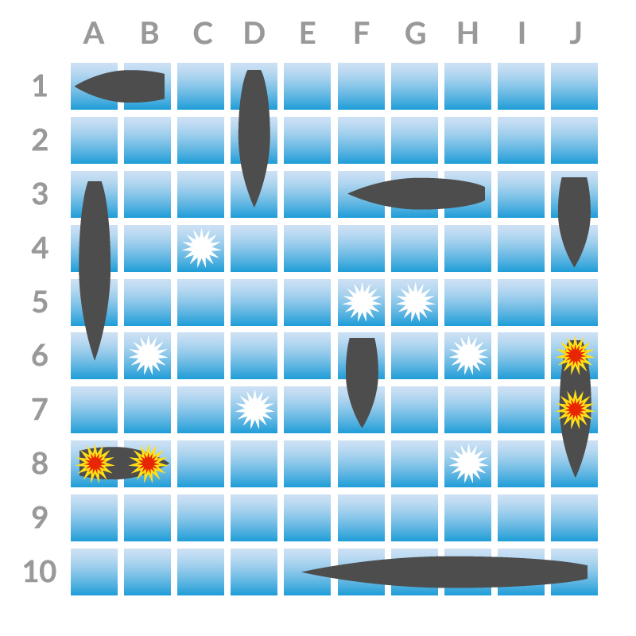

Referenced from [Makers Academy Battleships](https://github.com/makersacademy/course/blob/master/battle_ships/battle_ships.md) (private repo).

Battleships (or Battleship) is a game where each player has a board upon which they can place a number of ships. The boards are 10x10 two dimensional grid.



After each player has placed their ships on their own board they take turns to shoot on the opponents board. In each round, each player takes a turn to announce a target square in the opponent's grid which is to be shot at. The opponent announces whether or not the square is occupied by a ship, and if it is a _hit_ they mark this on their own primary grid. The attacking player notes the hit or miss on their own _tracking_ grid, in order to build up a picture of the opponent's fleet.

When all of one player's ships have been sunk the game finishes and the player who has ships remaining is the winner.

The code is intended to demonstrate a range of techniques:

* Dependency inversion (e.g. `Game` with `Player` and `Board` ) over tighter dependencies (e.g. `Board` and `Cell`)
* TDD and BDD
* Factory methods (e.g. `Ship.submarine`)
* Refactoring to create service objects (e.g. `CoordinateHandler`)
* Implementing `Enumerable` (`CoordinateHandler`)
* Emergent design.  No part of the code architecture was decided on up front.  All classes and refactoring emerged as a consequence of further tests being addded.

The game is fully playable in `irb`:
```
$ gem install battleships
$ irb
> require 'battleships'
```
Now create a new game using `Game`, `Player` and `Board` classes:
```
> game = Game.new Player, Board
```
Each player can place ships on their own board:
```
> game.player_1.place_ship Ship.battleship, :B4, :vertically

> game.player_2.place_ship Ship.carrier, :G6
```
Players can shoot at each other's boards:
```
> game.player_1.shoot :C2
 => :miss
> game.player_2.shoot :B4
 => :hit
```
Players can view their own boards:
```
> puts game.own_board_view game.player_1
   ABCDEFGHIJ
  ------------
 1|          |1
 2|          |2
 3|          |3
 4| *        |4
 5| B        |5
 6| B        |6
 7| B        |7
 8|          |8
 9|          |9
10|          |10
  ------------
   ABCDEFGHIJ
   
> puts game.own_board_view game.player_2
   ABCDEFGHIJ
  ------------
 1|          |1
 2|  -       |2
 3|          |3
 4|          |4
 5|          |5
 6|      CCC |6
 7|          |7
 8|          |8
 9|          |9
10|          |10
  ------------
   ABCDEFGHIJ
```
And their opponent's boards:
```
> puts game.opponent_board_view game.player_1
   ABCDEFGHIJ
  ------------
 1|          |1
 2|  -       |2
 3|          |3
 4|          |4
 5|          |5
 6|          |6
 7|          |7
 8|          |8
 9|          |9
10|          |10
  ------------
   ABCDEFGHIJ

> puts game.opponent_board_view game.player_1
   ABCDEFGHIJ
  ------------
 1|          |1
 2|          |2
 3|          |3
 4| *        |4
 5|          |5
 6|          |6
 7|          |7
 8|          |8
 9|          |9
10|          |10
  ------------
   ABCDEFGHIJ
```
Players can sink their opponent's ships:
```
game.player_2.shoot :B5
 => :hit
game.player_2.shoot :B6
 => :hit
game.player_2.shoot :B7
 => :sunk
```
And the game can be tested for a winner:
```
> game.has_winner?
 => true
> game.winner? game.player_1
 => false
> game.player_2.winner?
 => true
```
